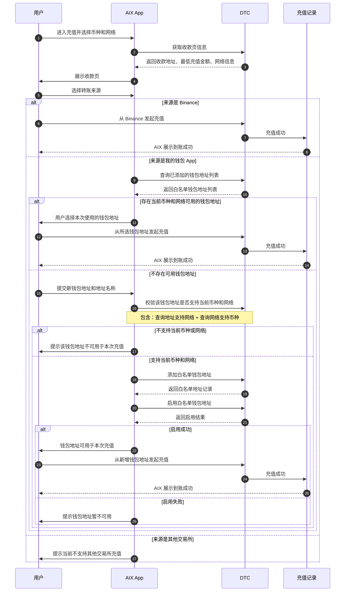

# Deposit Address Misuse Risk Control PRD

## 业务流程图

## DTC 接口说明

| 业务动作 | DTC 接口 |
|---|---|
| 查询已添加钱包地址 | `POST /openapi/v1/recipient/wallet-address/search` |
| 校验钱包地址支持网络 | `GET /openapi/v1/recipient/wallet-address/network/{address}` |
| 校验网络支持币种 | `GET /openapi/v1/recipient/wallet-address/currency/{mainNet}` |
| 添加白名单钱包地址 | `POST /openapi/v1/recipient/wallet-address/add-client-own` |
| 启用白名单钱包地址 | `POST /openapi/v1/recipient/wallet-address/set-enabled` |

## 当前定版口径

用户进入充值后，先选择币种和网络并进入收款页。用户在使用收款地址前，需要选择本次转账来源。

如果来源为 Binance，则沿用现有支持流程。

如果来源为我的钱包 App，AIX 先查询当前币种和网络下是否存在可用白名单钱包地址；存在则用户选择后继续，不存在则引导新增白名单钱包。

如果来源为其他交易所，则提示当前不支持，避免用户继续使用地址发起不支持来源的充值。

新增钱包地址时，AIX 需通过 DTC 完成支持性校验、添加白名单地址、启用白名单地址；启用成功后，该钱包地址可用于当前充值。
