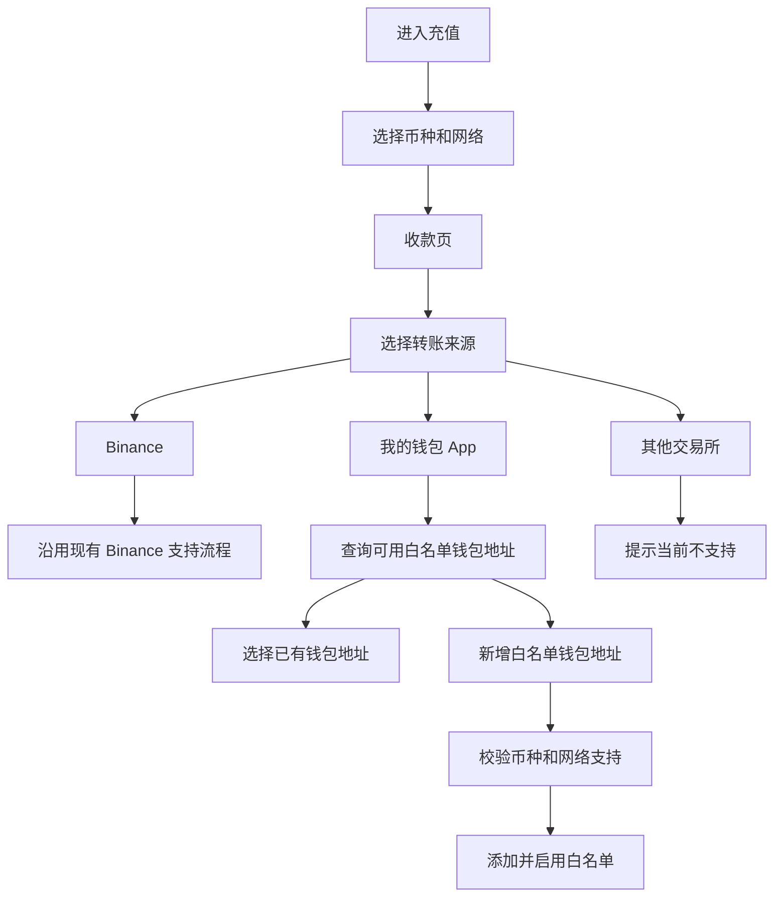
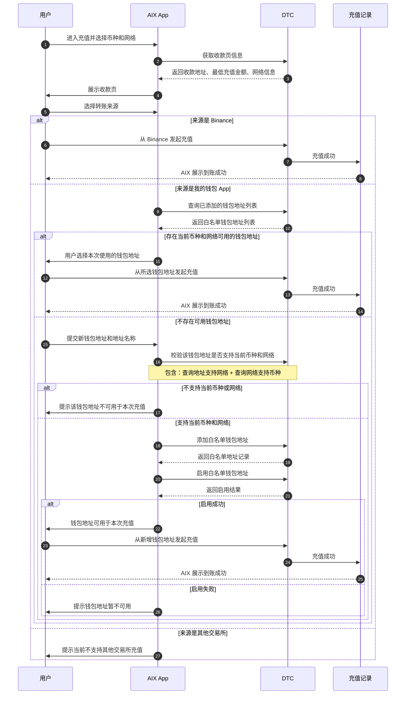

# 【Wallet】地址充值来源误用风控需求

# 需求变更日志

| 变更时间 | 变更人 | 变更内容 | 备注 |
|---|---|---|---|
| 2026-05-27 | Kelvin | 初稿 | 梳理地址充值来源误用问题与治理方案 |
| 2026-05-27 | Kelvin | 调整为标准 PRD 格式 | 按 Lark PRD 模板补充项目概述、功能结构、需求描述、接口说明、验收标准 |

# 引用资料

| 类型 | 链接 |
|---|---|
| PM | Kelvin |
| Figma | 待补充 |
| 翻译文案 | 待补充 |
| BRD | 待补充 |
| 技术方案 | 待补充 |
| DTC API 文档 | Crypto Address Whitelist API |
| AIX 代码依据 | AIX App 当前地址充值、Wallet Connect、交易状态映射相关代码 |

# 需求索引

| 业务端 | 需求模块 | 功能描述 | 作者 | 需求批次 | 需求状态 |
|---|---|---|---|---|---|
| 用户端 | Wallet / 地址充值 | 在用户使用收款地址前确认转账来源，避免 Binance-only 地址被用于非支持来源充值 | Kelvin | 2026-05 | PRD 编写中 |

# 项目概述

## 项目背景

当前 AIX 的地址充值流程中，用户在选择币种和网络后，可以在收款页复制充值地址。

现有 Binance / GTR 地址实际只支持从 Binance 发起充值。但用户按照行业常规操作时，可能会把该地址复制到其他钱包 App 或其他交易所中发起充值，导致 DTC 将充值标记为异常，AIX 前端展示为 Under Review。

同时，Wallet Connect 没有复制地址能力，无法覆盖用户“复制地址到外部 App 转账”的常规充值习惯。

本需求的核心不是新增一个充值方式，而是在用户使用收款地址前，确认本次转账来源，并针对不同来源做正确引导，降低错误来源导致的充值失败和 Under Review。

## 项目目的

1. 在用户使用收款地址前确认转账来源。
2. 保持用户熟悉的充值路径：先选择币种和网络，再进入收款页。
3. Binance 来源沿用现有支持流程，不增加不必要阻力。
4. 我的钱包 App 来源需要先确认是否存在可用白名单钱包地址。
5. 其他交易所来源明确提示不支持，避免用户继续错误充值。
6. 降低非支持来源导致的 Under Review。

## 名词解释

| 名词 | 说明 |
|---|---|
| 地址充值 | 用户复制 AIX 收款地址，并从外部 App 发起链上转账的充值方式 |
| Binance / GTR 地址 | 当前默认支持 Binance 来源充值的地址路径 |
| 我的钱包 App | 用户自己控制私钥的钱包 App，例如 MetaMask 等 |
| 其他交易所 | Binance 以外的交易所或平台托管地址，例如 OKX、Bybit、Coinbase 等 |
| 白名单钱包地址 | 用户添加并启用后，可作为本次充值来源的钱包地址 |
| Risk Withheld | DTC 侧异常待处理状态 |
| Under Review | AIX 用户侧展示的异常审核状态 |

# 项目计划

| 阶段 | 内容 | 状态 |
|---|---|---|
| PRD | 明确业务流程、页面范围、接口依赖、验收标准 | 进行中 |
| UX | 输出收款页来源选择、钱包地址选择、添加钱包地址、不支持提示等交互 | 待开始 |
| Tech Design | 明确前后端改造、DTC 接口封装、状态映射和埋点 | 待开始 |
| Development | 开发实现 | 待开始 |
| QA | 主流程、异常流程、接口失败、Under Review 场景验证 | 待开始 |

# 功能结构

# 需求描述

## 地址充值来源确认

### 流程说明

本需求采用“资产网络优先，来源使用前确认”的流程。

用户进入充值后，先选择充值币种和网络，并进入收款页。用户在使用收款地址前，需要选择本次转账来源。

如果来源为 Binance，则沿用现有支持流程。

如果来源为我的钱包 App，AIX 先查询当前币种和网络下是否存在可用白名单钱包地址；存在则用户选择后继续，不存在则引导新增白名单钱包。

如果来源为其他交易所，则提示当前不支持，避免用户继续使用地址发起不支持来源的充值。

新增钱包地址时，AIX 需通过 DTC 完成支持性校验、添加白名单地址、启用白名单地址；启用成功后，该钱包地址可用于当前充值。

### 页面概览

| 页面 / 模块 | 页面目的 | 关键规则 |
|---|---|---|
| 币种和网络选择 | 用户选择本次充值的资产和网络 | 保持现有行业常规路径 |
| 收款页 | 展示当前币种和网络的收款页信息，并要求用户选择转账来源 | 用户在使用收款地址前必须确认来源 |
| 转账来源选择 | 区分 Binance、我的钱包 App、其他交易所 | 不使用“Copy Address”作为一级入口 |
| 我的钱包地址选择 | 展示当前币种和网络下可用的钱包地址 | 已有可用地址可直接选择；没有则新增 |
| 新增白名单钱包地址 | 用户添加自己的发送钱包地址 | 需完成 DTC 支持性校验、添加和启用 |
| 其他交易所不支持提示 | 阻断不支持来源 | 不进入地址使用流程 |
| Under Review 说明 | 解释异常原因 | 说明可能与转账来源不符合要求有关 |

## 业务流程图

## 页面规则

### 收款页

#### 页面目的

展示当前币种和网络下的收款信息，并在用户使用收款地址前确认转账来源。

#### 展示内容

| 信息 | 说明 |
|---|---|
| 收款地址 | 用户最终用于充值的 AIX 收款地址 |
| 二维码内容 | 基于收款地址生成，用于扫码转账 |
| 当前币种 | 用户选择的充值币种 |
| 当前网络 | 用户选择的充值网络 |
| 最低充值金额 | 当前币种和网络要求的最小充值金额 |
| 网络说明 | 预计到账时间、网络提示等 |
| 来源限制提示 | 根据用户选择的来源展示必要提示 |

#### 规则

- 用户进入收款页后，需要选择转账来源。
- 转账来源包括 Binance、我的钱包 App、其他交易所。
- 不将“复制地址”作为一级充值方式。
- 来源选择用于判断本次充值是否可继续。

### Binance 来源

#### 页面目的

支持用户从 Binance 发起充值。

#### 规则

- 沿用现有 Binance / GTR 支持流程。
- 不需要新增白名单钱包地址。
- 不需要校验用户钱包地址。
- 用户需从 Binance 发起充值。
- 如果用户实际从非 Binance 来源充值，仍可能进入 Under Review。

### 我的钱包 App 来源

#### 页面目的

支持用户从自己控制的钱包 App 发起地址充值。

#### 规则

- AIX 查询用户已添加的白名单钱包地址。
- 仅展示当前币种和网络下可用的钱包地址。
- 如果存在可用钱包地址，用户选择本次转账使用的钱包地址。
- 如果不存在可用钱包地址，用户需要新增白名单钱包地址。
- 已有钱包地址不需要再次执行新增地址校验。
- 新增钱包地址时，需要先确认该地址支持当前币种和网络。
- 白名单钱包地址启用成功后，才可用于本次充值。

### 新增白名单钱包地址

#### 页面目的

让用户添加自己的发送钱包地址，并使其成为当前币种和网络下可用的充值来源。

#### 输入字段

| 字段 | 说明 |
|---|---|
| 钱包地址 | 用户外部发送钱包地址 |
| 地址名称 | 用户自定义标签，用于识别地址 |
| 当前网络 | 从充值网络带入 |
| 当前币种 | 从充值币种带入 |

#### 规则

1. AIX 校验该钱包地址是否支持当前币种和网络。
2. 如果不支持，则提示该钱包地址不可用于本次充值。
3. 如果支持，则添加白名单钱包地址。
4. 添加成功后，继续启用白名单钱包地址。
5. 启用成功后，该钱包地址可用于本次充值。
6. 启用失败时，提示钱包地址暂不可用。

### 其他交易所来源

#### 页面目的

阻断当前不支持的其他交易所充值。

#### 规则

- 用户选择“其他交易所”作为转账来源时，提示当前不支持其他交易所充值。
- 不进入地址使用流程。
- 不引导添加白名单钱包地址。
- 给出替代建议：使用 Binance 或自己的钱包 App。

# 接口说明

## DTC 接口

| 业务动作 | DTC 接口 | 说明 |
|---|---|---|
| 查询已添加钱包地址 | `POST /openapi/v1/recipient/wallet-address/search` | 查询当前用户已添加的白名单钱包地址列表 |
| 校验钱包地址支持网络 | `GET /openapi/v1/recipient/wallet-address/network/{address}` | 查询用户输入的钱包地址支持哪些网络 |
| 校验网络支持币种 | `GET /openapi/v1/recipient/wallet-address/currency/{mainNet}` | 查询当前网络支持哪些币种 |
| 添加白名单钱包地址 | `POST /openapi/v1/recipient/wallet-address/add-client-own` | 添加用户自己的钱包地址到白名单 |
| 启用白名单钱包地址 | `POST /openapi/v1/recipient/wallet-address/set-enabled` | 启用白名单钱包地址，启用后才可用 |

说明：流程图中“校验该钱包地址是否支持当前币种和网络”是业务合并表达，实际包含“查询地址支持网络”和“查询网络支持币种”两个 DTC 接口。

# 状态与异常

## Under Review 规则

当用户实际充值来源不符合要求时，DTC 可能将充值标记为 Risk Withheld，AIX 用户侧展示为 Under Review。

可能原因包括：

- 用户从非 Binance 来源使用了 Binance / GTR 地址。
- 用户从未添加的钱包地址充值。
- 用户从未启用的钱包地址充值。
- 用户从不匹配当前网络或币种的钱包地址充值。
- 用户从当前不支持的其他交易所充值。

如果用户实际从自己的钱包地址充值，且后续成功添加并启用该地址，异常充值可根据 DTC 规则继续处理为成功。

# 需求范围

## In Scope

1. 充值币种和网络选择流程后的收款页来源确认。
2. Binance / 我的钱包 App / 其他交易所三类来源处理。
3. 我的钱包 App 下的已有白名单钱包查询与选择。
4. 新增白名单钱包地址流程。
5. DTC 白名单相关接口对接。
6. 其他交易所不支持提示。
7. Under Review 原因说明。

## Out of Scope

1. 支持 Binance 以外的其他交易所充值。
2. 自动识别所有交易所地址。
3. 改造 DTC / GTR 底层充值能力。
4. 改造 Wallet Connect 流程。
5. 保证所有 Under Review 充值都能自动成功。

# 埋点建议

| 事件 | 触发时机 | 关键属性 |
|---|---|---|
| deposit_receive_page_view | 用户进入收款页 | currency, network |
| deposit_source_select | 用户选择转账来源 | source, currency, network |
| wallet_whitelist_list_result | 查询白名单钱包地址列表后 | has_available_address, currency, network |
| wallet_whitelist_add_submit | 用户提交新增钱包地址 | currency, network |
| wallet_whitelist_add_result | 新增白名单钱包地址结果 | result, reason |
| wallet_whitelist_enable_result | 启用白名单钱包地址结果 | result, reason |
| unsupported_exchange_view | 用户选择其他交易所 | currency, network |
| under_review_detail_view | 用户查看 Under Review 详情 | reason_code |

# 验收标准

1. 用户进入充值后，仍按币种和网络进入收款页。
2. 用户在使用收款地址前，需要选择转账来源。
3. 选择 Binance 时，沿用现有支持流程。
4. 选择我的钱包 App 时，系统优先查询并展示当前币种和网络下可用的钱包地址。
5. 如果没有可用钱包地址，用户可以新增白名单钱包地址。
6. 新增白名单钱包地址时，必须完成支持性校验、添加白名单、启用白名单。
7. 钱包地址不支持当前币种或网络时，不能继续作为本次充值来源。
8. 启用失败时，不能把该钱包地址视为可用。
9. 选择其他交易所时，提示当前不支持，不继续进入地址使用流程。
10. Under Review 详情需说明可能与转账来源不符合要求有关。

# 待确认问题

1. 收款页来源选择是页面内模块还是弹窗。
2. 其他交易所不支持页是否需要提供“改用 Binance / 改用我的钱包 App”两个入口。
3. 白名单钱包地址的“可用”判断是否仅以 enabled + 当前币种 + 当前网络为准。
4. 启用白名单钱包地址失败时，是否存在需要单独展示的 DTC 错误码。
5. Under Review 详情页是否能展示具体原因码，还是只展示泛化说明。
