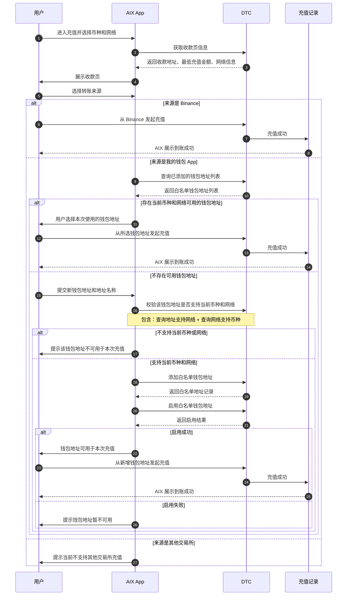

# Deposit Address Misuse Risk Control PRD

## 1. 背景

当前 AIX 的地址充值流程中，用户在选择币种和网络后，可以在收款页复制充值地址。

现有 Binance / GTR 地址实际只支持从 Binance 发起充值。但用户按照行业常规操作时，可能会把该地址复制到其他钱包 App 或其他交易所中发起充值，导致 DTC 将充值标记为异常，AIX 前端展示为 Under Review。

同时，Wallet Connect 没有复制地址能力，无法覆盖用户“复制地址到外部 App 转账”的常规充值习惯。

本需求的核心不是新增一个充值方式，而是在用户使用收款地址前，确认本次转账来源，并针对不同来源做正确引导，降低错误来源导致的充值失败和 Under Review。

---

## 2. 问题定义

### 2.1 用户问题

用户不知道以下限制：

- Binance / GTR 地址只支持从 Binance 发起充值。
- 从自己的钱包 App 充值前，需要使用已添加且可用的白名单钱包地址。
- 其他交易所当前不支持充值。
- 如果来源不符合要求，充值可能进入 Under Review。

### 2.2 产品问题

当前流程中，用户在复制地址前没有被要求确认转账来源。用户会把收款地址理解为行业通用充值地址，从而在错误来源中使用。

### 2.3 业务问题

如果只新增一个 Wallet 入口，但不治理现有收款页的复制地址行为，用户仍可能继续复制 Binance / GTR 地址到非 Binance 来源使用，失败 case 不能被有效降低。

---

## 3. 产品目标

1. 在用户使用收款地址前确认转账来源。
2. 保持用户熟悉的充值路径：先选择币种和网络，再进入收款页。
3. Binance 来源沿用现有支持流程，不增加不必要阻力。
4. 我的钱包 App 来源需要先确认是否存在可用白名单钱包地址。
5. 其他交易所来源明确提示不支持，避免用户继续错误充值。
6. 降低非支持来源导致的 Under Review。

---

## 4. 方案原则

### 4.1 资产网络优先

用户进入充值后，仍先选择充值币种和网络。该流程符合行业常规，避免用户在第一步被迫理解来源差异。

### 4.2 来源使用前确认

用户进入收款页后，在使用收款地址前，需要选择本次转账来源。

来源包括：

- Binance
- 我的钱包 App
- 其他交易所

### 4.3 风险来源前置拦截

对于其他交易所，不提供继续使用地址的路径，直接提示当前不支持。

### 4.4 已有钱包优先

用户选择“我的钱包 App”后，AIX 优先查询当前币种和网络下是否已有可用白名单钱包地址。存在则用户选择已有地址；不存在才进入新增白名单钱包流程。

---

## 5. 业务流程图

---

## 6. 核心业务规则

### 6.1 收款页信息

AIX 获取并展示当前币种和网络下的收款页信息，包括：

- 收款地址
- 二维码内容
- 当前币种
- 当前网络
- 最低充值金额
- 网络说明
- 必要的充值限制提示

### 6.2 Binance 来源

用户选择 Binance 作为转账来源时，沿用现有 Binance / GTR 支持流程。

规则：

- 不需要新增白名单钱包地址。
- 不需要额外校验用户钱包地址。
- 用户需从 Binance 发起充值。
- 如果用户实际从非 Binance 来源充值，仍可能进入 Under Review。

### 6.3 我的钱包 App 来源

用户选择“我的钱包 App”作为转账来源时，AIX 查询用户已添加的白名单钱包地址，并筛选当前币种和网络下可用的钱包地址。

规则：

- 如果存在可用钱包地址，用户选择本次转账使用的钱包地址。
- 如果不存在可用钱包地址，用户需要新增白名单钱包地址。
- 已有钱包地址不需要再次执行新增地址校验。
- 新增钱包地址时，需要先确认该地址支持当前币种和网络。
- 白名单钱包地址启用成功后，才可用于本次充值。

### 6.4 其他交易所来源

用户选择“其他交易所”作为转账来源时，AIX 提示当前不支持其他交易所充值。

规则：

- 不进入地址使用流程。
- 不引导添加白名单钱包地址。
- 给出替代建议：使用 Binance 或自己的钱包 App。

---

## 7. 新增白名单钱包规则

用户新增钱包地址时，需要提交：

| 字段 | 说明 |
|---|---|
| 钱包地址 | 用户外部发送钱包地址 |
| 地址名称 | 用户自定义标签，用于识别地址 |
| 当前网络 | 从充值网络带入 |
| 当前币种 | 从充值币种带入 |

新增流程规则：

1. AIX 校验该钱包地址是否支持当前币种和网络。
2. 如果不支持，则提示该钱包地址不可用于本次充值。
3. 如果支持，则添加白名单钱包地址。
4. 添加成功后，继续启用白名单钱包地址。
5. 启用成功后，该钱包地址可用于本次充值。
6. 启用失败时，提示钱包地址暂不可用。

---

## 8. DTC 接口说明

| 业务动作 | DTC 接口 | 说明 |
|---|---|---|
| 查询已添加钱包地址 | `POST /openapi/v1/recipient/wallet-address/search` | 查询当前用户已添加的白名单钱包地址列表 |
| 校验钱包地址支持网络 | `GET /openapi/v1/recipient/wallet-address/network/{address}` | 查询用户输入的钱包地址支持哪些网络 |
| 校验网络支持币种 | `GET /openapi/v1/recipient/wallet-address/currency/{mainNet}` | 查询当前网络支持哪些币种 |
| 添加白名单钱包地址 | `POST /openapi/v1/recipient/wallet-address/add-client-own` | 添加用户自己的钱包地址到白名单 |
| 启用白名单钱包地址 | `POST /openapi/v1/recipient/wallet-address/set-enabled` | 启用白名单钱包地址，启用后才可用 |

说明：流程图中“校验该钱包地址是否支持当前币种和网络”是业务合并表达，实际包含“查询地址支持网络”和“查询网络支持币种”两个 DTC 接口。

---

## 9. Under Review 规则

当用户实际充值来源不符合要求时，DTC 可能将充值标记为 Risk Withheld，AIX 用户侧展示为 Under Review。

可能原因包括：

- 用户从非 Binance 来源使用了 Binance / GTR 地址。
- 用户从未添加的钱包地址充值。
- 用户从未启用的钱包地址充值。
- 用户从不匹配当前网络或币种的钱包地址充值。
- 用户从当前不支持的其他交易所充值。

如果用户实际从自己的钱包地址充值，且后续成功添加并启用该地址，异常充值可根据 DTC 规则继续处理为成功。

---

## 10. 页面范围

本需求涉及以下页面或模块：

1. 充值币种和网络选择流程
2. 收款页
3. 转账来源选择
4. 我的钱包地址选择
5. 新增白名单钱包地址
6. 其他交易所不支持提示
7. 充值记录 / Under Review 状态说明

---

## 11. Out of Scope

本次不包含：

1. 支持 Binance 以外的其他交易所充值。
2. 自动识别所有交易所地址。
3. 改造 DTC / GTR 底层充值能力。
4. 改造 Wallet Connect 流程。
5. 保证所有 Under Review 充值都能自动成功。

---

## 12. 验收标准

1. 用户进入充值后，仍按币种和网络进入收款页。
2. 用户在使用收款地址前，需要选择转账来源。
3. 选择 Binance 时，沿用现有支持流程。
4. 选择我的钱包 App 时，系统优先查询并展示当前币种和网络下可用的钱包地址。
5. 如果没有可用钱包地址，用户可以新增白名单钱包地址。
6. 新增白名单钱包地址时，必须完成支持性校验、添加白名单、启用白名单。
7. 钱包地址不支持当前币种或网络时，不能继续作为本次充值来源。
8. 启用失败时，不能把该钱包地址视为可用。
9. 选择其他交易所时，提示当前不支持，不继续进入地址使用流程。
10. Under Review 详情需说明可能与转账来源不符合要求有关。

---

## 13. 当前定版口径

本需求采用“资产网络优先，来源使用前确认”的流程。

用户进入充值后，先选择充值币种和网络，并进入收款页。用户在使用收款地址前，需要选择本次转账来源。

如果来源为 Binance，则沿用现有支持流程。

如果来源为我的钱包 App，AIX 先查询当前币种和网络下是否存在可用白名单钱包地址；存在则用户选择后继续，不存在则引导新增白名单钱包。

如果来源为其他交易所，则提示当前不支持，避免用户继续使用地址发起不支持来源的充值。

新增钱包地址时，AIX 需通过 DTC 完成支持性校验、添加白名单地址、启用白名单地址；启用成功后，该钱包地址可用于当前充值。
